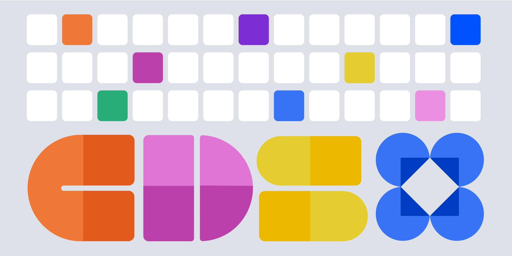

# Coinbase Design System

<p align="center">
  
</p>

Welcome to the Coinbase Design System (CDS)!

Please visit our website https://cds.coinbase.com for the latest documentation.

## Setup

1. **Clone the repository**

```sh
git clone git@github.com:coinbase/cds.git
cd cds
```

2. **Use the correct Node.js version**

We suggest [nvm](https://github.com/nvm-sh/nvm/tree/master) to manage Node.js versions. If you have it installed, you can use these commands to set our current Node.js version.

```sh
nvm install
nvm use
corepack enable
```

3. **Install dependencies**

```sh
yarn install
```

## Quick Start

Run one of the available apps to get started:

### Storybook (Web)

```sh
yarn nx run storybook:dev
```

### Documentation Site

```sh
yarn nx run docs:dev
```

### Mobile App

```sh
yarn nx run expo-app:ios
yarn nx run expo-app:android
```

See [apps/expo-app/README.md](apps/expo-app/README.md) for details.

### Native Android App

```sh
yarn nx run android-app:launch
```

Requires JDK 21 and the Android SDK, which `yarn install` does not provide. See
[packages/cds-android/README.md](packages/cds-android/README.md) for setup.

Unlike the Expo app, there is no dev server: Compose compiles into the APK, so `launch` builds,
installs, and starts the app and then exits, and you re-run it to pick up changes.

**For Kotlin work, open `android/` in Android Studio** — that folder, not the repo root. It is the
Gradle root for both Android projects, and Studio is where the fast feedback loop lives: `@Preview`
renders composables with no emulator, and Live Edit patches a running app without a rebuild.
Neither has a command-line equivalent. The modules still point at `packages/cds-android` and
`apps/android-app`, so you are editing the same files either way. See
[android/README.md](android/README.md).

## Platforms

CDS ships on three platforms, and they are at different stages:

| Platform                         | Package                | Distribution                               |
| -------------------------------- | ---------------------- | ------------------------------------------ |
| Web (React)                      | `packages/web`         | npm, `@coinbase/cds-web`                   |
| Mobile (React Native)            | `packages/mobile`      | npm, `@coinbase/cds-mobile`                |
| Native Android (Jetpack Compose) | `packages/cds-android` | GitHub Release AAR, `com.coinbase.cds:cds` |

Web and React Native share design tokens through `@coinbase/cds-common`. Kotlin cannot consume a
TypeScript package, so the Android tokens are currently a hand-maintained port and **will drift**
from the other two until we have a shared token source that generates all three. That codegen is
the intended way to unite the platforms; treating any one package's tokens as authoritative in the
meantime is a mistake.

## Contributing

We welcome contributions to the Coinbase Design System! Please read our [Contributing Guide](CONTRIBUTING.md) for details on our development process, coding standards, and how to submit pull requests.

## Versioning

CDS generally follows [Semantic Versioning](https://semver.org/spec/v2.0.0.html).

We aim to preserve type/public API compatibility across minor and patch releases.
Visual changes are allowed in minor releases.
Review changelog entries and validate UI when upgrading.

## Security

For information about reporting security vulnerabilities, please see our [Security Policy](SECURITY.md).

## License

This project is licensed under the terms described in [LICENSE](LICENSE).
