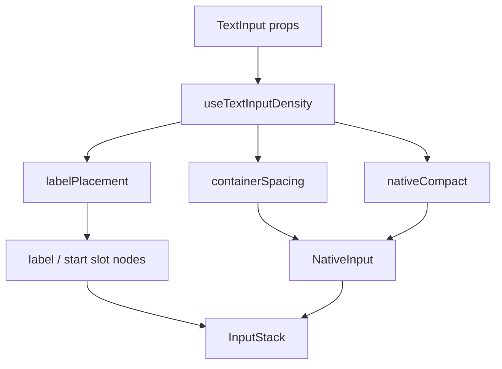

# Mobile TextInput `size` density API

Proposal to replace binary `compact` with t-shirt `size` density on mobile TextInput, while keeping legacy `compact` fully backwards compatible.

## Decisions locked in

- **Platform:** mobile only (`packages/mobile`). No web changes.
- **Default density:** large — `paddingY` 16 (`theme.space[2]`).
- **`size` values:** `'s' | 'm' | 'l'` → `paddingY` `theme.space[1 | 1.5 | 2]` (8 / 12 / 16).
- **`paddingX`:** today’s non-compact inset (`theme.space[2]`), except legacy `compact` (all-around `theme.space[1]`).
- **`size` stays on TextInput only** — never passed to [`NativeInput`](./NativeInput.tsx).
- **Keep sharing props with Select** — continue extending `SharedInputProps`; only override `compact` locally for deprecation.

## Why not modify NativeInput

`NativeInput` is a low-level field used by TextInput and also [`DefaultComboboxControl`](../alpha/combobox/DefaultComboboxControl.tsx). Density is a TextInput product concern.

**Encapsulation:** TextInput resolves density → padding / label placement, then feeds NativeInput only through existing knobs:

- `containerSpacing` (already merges on top of NativeInput’s base padding)
- `compact` **only for legacy compact path** (preserves today’s NativeInput `padding: space[1]` behavior)
- For the size path: do **not** pass `compact`; override vertical inset via `containerSpacing.paddingVertical` when `resolvedSize` is `s`/`m` (NativeInput’s default all-around `space[2]` already matches `l`)

No `size` prop, no density map, and ideally no behavioral change inside `NativeInput.tsx`.

## Types approach (share props, override `compact`)

On mobile [`TextInputBaseProps`](./TextInput.tsx):

```ts
Omit<SharedInputProps, 'compact'> & {
  /**
   * @deprecated Use `size` instead. This will be removed in a future major release.
   * @deprecationExpectedRemoval v10
   */
  compact?: boolean;
  /** @default 'l' */
  size?: 's' | 'm' | 'l';
}
```

Leave [`SharedInputProps`](../../../common/src/types/InputBaseProps.ts) and web/Select untouched.

## Precedence (backwards compatible)

```ts
const useLegacyCompact = Boolean(compact) && size === undefined;
const resolvedSize: TextInputSize = size ?? 'l';
```

| Inputs         | Behavior                              |
| -------------- | ------------------------------------- |
| neither        | `resolvedSize = 'l'`, size path       |
| `compact` only | **legacy compact** (today’s behavior) |
| `size` only    | size path; ignore compact             |
| both           | size path; **ignore compact**         |

## Label placement matrix

| Mode                           | `labelVariant` | Label placement                                           |
| ------------------------------ | -------------- | --------------------------------------------------------- |
| Legacy `compact`               | any            | Forced into start slot (unchanged)                        |
| size path + `outside`          | `outside`      | Outside, above — including `s`/`m`                        |
| `size="l"` + `inside`          | `inside`       | Vertical stack inside field                               |
| `size="s"` or `"m"` + `inside` | `inside`       | Horizontal in start slot — without forcing when `outside` |

## Design: untangle the complexity

TextInput today mixes focus, a11y, density, and four label layouts in one file. Prefer a thin orchestrator + one density module over growing more conditionals in place.

### 1. `useTextInputDensity` (new, mobile-local)

Suggested path: [`useTextInputDensity.ts`](./useTextInputDensity.ts)

Single place for size/compact/label rules. Returns a small discriminated result, e.g.:

```ts
type TextInputLabelPlacement =
  | 'outside'
  | 'inside-vertical'
  | 'inside-horizontal'
  | 'legacy-compact';

type TextInputDensity = {
  useLegacyCompact: boolean;
  resolvedSize: 's' | 'm' | 'l';
  labelPlacement: TextInputLabelPlacement;
  /** Merged into NativeInput containerSpacing — owns size paddingY overrides + existing start/inside tweaks */
  containerSpacing: ViewStyle;
  /** Pass through to NativeInput only when legacy compact */
  nativeCompact?: boolean;
  /** What to pass to InputStack as labelVariant */
  inputStackLabelVariant: 'inside' | 'outside';
};
```

Constants live next to the hook:

```ts
const textInputSizePaddingY = { s: 1, m: 1.5, l: 2 } as const;
```

### 2. Label slot helper (optional but recommended)

If label JSX stays hard to read after the hook, extract a pure helper/component in the same folder, e.g. `getTextInputLabelNodes({ labelPlacement, label, labelNode, ... })` returning `{ stackLabelNode, startLabelNode }` — the two places labels can appear today.

Keep it presentational; no focus state inside.

### 3. `TextInput` as orchestrator

[`TextInput.tsx`](./TextInput.tsx) keeps:

- `useComponentConfig`, focus, refs, border styles, a11y start-node handling
- Call `useTextInputDensity`
- Wire `InputStack` + `NativeInput` from density + existing nodes

Avoid nesting a second mega-component; the win is **separating policy (density) from wiring (slots)**.



## Deprecation

- Deprecate mobile TextInput’s overridden `compact` only.
- Replacement: `size` + explicit `labelVariant`.
- Follow the deprecate-cds-api skill.
- **Assumed removal major: `v10`** (cds-mobile `9.6.3`).

## Files to touch

- [`TextInput.tsx`](./TextInput.tsx) — API + orchestration
- [`useTextInputDensity.ts`](./useTextInputDensity.ts) — **new** density policy
- Optional: small label-slot helper next to TextInput
- Tests / stories / docs metadata for mobile TextInput

**Do not modify** [`NativeInput.tsx`](./NativeInput.tsx) unless a bug forces it (goal: zero changes).

No changes to `packages/common` or `packages/web`.

## Verification

- Unit tests for density hook + TextInput matrix
- `yarn nx run mobile:typecheck`
- `yarn nx run mobile:lint`
- `yarn nx format:write`

## Implementation checklist

- [ ] Keep `SharedInputProps` on mobile TextInput; `Omit` compact and redeclare it deprecated; add local `size` prop
- [ ] Extract `useTextInputDensity` (precedence, label placement, field padding styles) — size never reaches NativeInput
- [ ] Simplify TextInput to orchestrate InputStack from density result; extract label-slot helper if it clarifies
- [ ] Add tests + stories for size × labelVariant and compact precedence
- [ ] Add `@deprecated` JSDoc (`v10`) and docs metadata; run typecheck/lint/format
